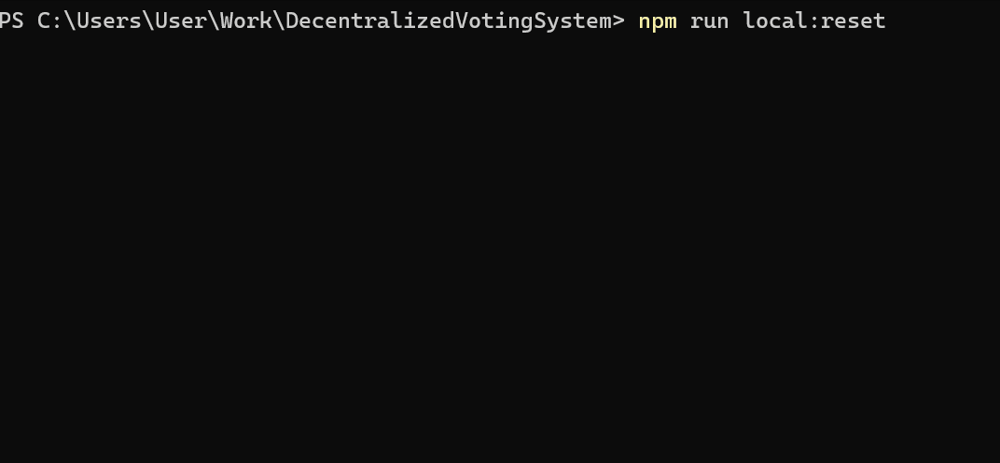

# Decentralized Voting System

This project is not finished yet.

## About
Project created to increase my portfolio and skills in implementing fullstack applications. Idea of project is to provide ability for users to create and vote for certain projects. Each project consist of name, description, image, amount of money allocated and treasury. When project reached certain amount of voting requested amount of money will be transferred from voting system to project treasury to fund certain features of projects. If project can't get enough voting then it will be canceled.
## High level documentation
### How to run
#### Install node modules
First need to install all modules in all parts of project ([server](./server), [web](./web/), [smartcontracts](./smartcontracts/)).

#### Run containers
All services are [dockerized](./docker-compose.yml) so they all can be run via command (there are a lot of services so they consume a lot of ram)
```
docker compose up -d
```
This will run all services of server side, web application and local blockchain.

#### Seed
After that everything needed to be seeded (including deploying smart contracts into local chain). It can be done via simple command
```
npm run local:reset
```

If everything correct it will start [script](./scripts/reset.js) which will reset and seed everything and show animation like this


Local reset will recreate all databases, seed them, reset local chain and deployed contracts.
## Documentation
Each part of project have own documentation page.
1. [Server](./server/README.md)
2. [Web](./web/README.md)
3. [Smart contracts](./smartcontracts/README.md)